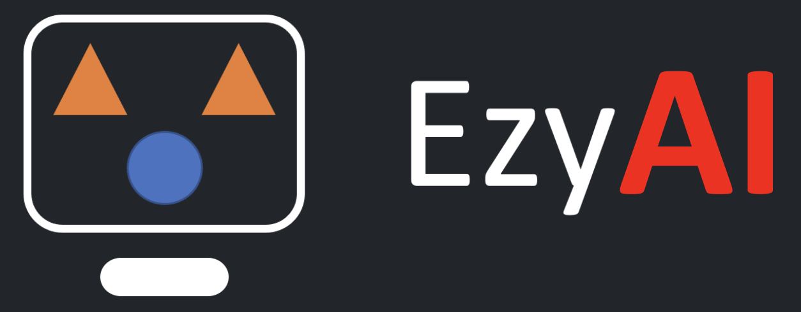

<p align="center">
  <a href="" rel="noopener">
 </a>
</p>

<h2 align="center">Ezyai-Framework</h3>

<div align="center">

[]()
[](https://ezyai-demo-190848466027.us-central1.sourcemanager.dev/ezyai-demos/ezyai-framework/issues)
[](https://ezyai-demo-190848466027.us-central1.sourcemanager.dev/ezyai-demos/ezyai-framework/pulls)
[](/LICENSE)

</div>

---

<p align="center"> 
This repo contains the code for EzyAI Framework which can be used in customer engagements.
    <br> 
</p>

## 📝 Table of Contents

- [About](#about)
- [Getting Started](#getting_started)
- [Deployment](#deployment)
- [Usage](#usage)
- [Built Using](#built_using)
- [Contributing](#contributing)
- [Authors](#authors)
- [Acknowledgments](#acknowledgement)

## 🧐 About <a name = "about"></a>

* EzyAI-Framework is a powerful and easy-to-use Python framework built on top of FastAPI and HTML templates. It is designed to streamline the development and deployment of generative AI applications, reducing the time to implementation for developers.

* With its built-in utilities and features, EzyAI-Framework offers:

  * Rapid development: Pre-built components and templates allow you to quickly build and deploy your AI applications.
  * Simplified deployment: Streamlined integration with FastAPI enables hassle-free deployment of your applications.
  * Increased productivity: EzyAI-Framework handles the complexities of code optimization and infrastructure management, allowing you to focus on the core functionality of your application.
  * Time saving: Reduces the time to implement your generative AI solutions, allowing you to focus on innovation and creativity.
* EzyAI-Framework is the ideal solution for developers and researchers looking to build and deploy generative AI applications quickly and efficiently.

## 🏁 Getting Started <a name = "getting_started"></a>

These instructions will get you a copy of the project up and running on your local machine for development and testing purposes. See [deployment](#deployment) for notes on how to deploy the project on a live system.

### Prerequisites

This project requires the following software to be installed:

Python 3.9 or higher
To install Python, you can follow the instructions on the official [Python website](https://www.python.org/downloads/)

You can check your Python version by running the following command:
```
python --version
```
In addition to Python, you may also need to install additional dependencies depending on the specific project requirements. These dependencies will typically be listed in a requirements.txt file within the project directory.

You can install the dependencies by running the following command:
```
pip install -r requirements.txt
```
Once you have installed all of the prerequisites, you should be able to run the project code.

Additional notes
* If you are using a virtual environment, make sure that you activate it before installing the dependencies.
* If you encounter any errors while installing the dependencies, you can try searching for solutions online or asking for help on a community forum such as Stack Overflow.

### Installing

A step by step series of examples that tell you how to get a development env running.
1. Clone the repository: 
``` 
git clone https://ezyai-demo-190848466027-git.us-central1.sourcemanager.dev/ezyai-demos/ezyai-framework.git 
```
2. Change directory to the cloned repo:
```
cd ezyai-framework
```
3. Create a virtual environment:
```
python -m venv venv
```
4. Activate the virtual environment:
```
source venv/bin/activate
```
5. Install dependencies:
```
pip install -r requirements.txt
```
6. You should now be able to run the project code! For example:
```
python main.py
```
7. Once the above command it run it will start serving the Application endpoint on [localhost](http://localhost:5000)
8. The Current Setup runs multiple endpoints which server UI,APIs,Swagger


## 🎈 Usage <a name="usage"></a>

1. The Framework comprises of multiple utilities and skeleton framework which can be used to setup and deploy GenAI applications 
2. The Structure of Framework is divided in 3 subfolders - Frontend, Backend, Router
    * Router - This directory contains all routes that are being servered as part of the webserver
    * Frontend - This Directory contains all Code and templates to render a frontend for the GenAI Application
    * Backend - This Directory contains all the python utilities and structure which are requried to run a GenAI application
3. To utilise the framework the requested directories would need to be modified based on the use case with appropriate business logic Implementations


## 🚀 Deployment <a name = "deployment"></a>

1. The code repository contains a Dockerfile which servers as its instruction 
2. Dockerfile can be used to build the container image for the application using the below command 
```
docker build -t <Name of the image> .
```
3. Once image is created it can be stored in a Image respository such as [Artifact Registry](https://cloud.google.com/artifact-registry)
4. Using the Container Image the Application can be deployed to services like [Cloud Run](https://cloud.google.com/run),[GKE](https://cloud.google.com/kubernetes-engine),[AppEngine](https://cloud.google.com/appengine)

## ⛏️ Built Using <a name = "built_using"></a>

- [Google Cloud](https://cloud.google.com/) - Google Cloud
- [Python](https://python.org) - Python
- [FastAPI](https://fastapi.tiangolo.com/) - FastAPI
- [Gemini](https://gemini.google.com/) - Gemini

## ✍️ Authors <a name = "authors"></a>

- [Ruchir Jain](mailto:ruchirjain@google.com)
- [Shivam Somani](mailto:shivamsomani@google.com)
- [Saqib Khan](mailto:ksaqib@google.com)
- [Akshay Bathija](mailto:akshaybathija@google.com)

See also the list of [contributors]() who participated in this project.

## 🎉 Acknowledgements <a name = "acknowledgement"></a>

- Hat tip to folks whose code was used
  * [Moksh Atukuri](mailto:mokshazna@google.com)
  * [Chiranjeevi Raghavendra](mailto:chiranjeevitr@google.com) 
- Inspiration
- References

## Contributing

We welcome contributions! Please reach out to ezyai-developers@google.com.